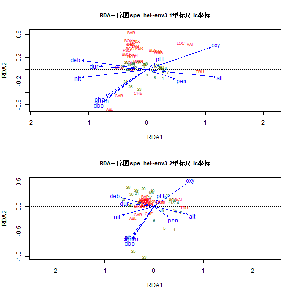

非约束排序只分析一个数据矩阵，并在低维的可视化正交排序轴空间展示这些数据的结构。虽然为了更好地解读排序图，可以在非约束排序之后被动的加入解释变量。而典范排序是直接从开始加入解释变量进行运算，只提取和展示与解释变量有关的数据结构，并可以通过统计检验方法检验解释变量与响应变量之间关系的显著性。

典范排序方法根据两个矩阵所扮演的角色不同可以分为对称（symmetrical）分析和非对称（asymmetrical）分析。

[toc]

# 非对称分析
## 冗余分析（RDA）
RDA是一种回归分析结合主成分分析的排序方法，也是多响应变量（multiresponse）多元回归分析的拓展。
RDA的计算过程，Y矩阵是中心化的响应变量矩阵，X矩阵是中心化的解释变量矩阵
- 先进行Y矩阵中每个响应变量与所有解释变量的多元回归，获得每个响应变量的拟合值（$\hat{y}$）向量（这是大多数分析中唯一需要的矩阵）和残差（$y_{res}$）向量（如果有必要）。将所有拟合值（$\hat{y}$）向量组装为拟合值矩阵（$\hat{Y}$）。
- 进行$Y$~$X$典范性的显著性检验
- 如果检验显著，即$X$能解释$Y$的变化量比随机数据还要多，将拟合值矩阵（$\hat{Y}$）进行PCA分析。PCA分析将产生一个典范特征根向量和典范特征向量矩阵$U$。
- 使用矩阵$U$计算两套样方排序得分（坐标）：一套使用拟合值矩阵（$\hat{Y}$）获得解释变量$X$空间内的样方排序坐标，即计算$\hat{Y}U$，所获得的坐标在vegan包里被称为“样方约束（约束变量的线性组合），Site constraints（linear combinations of constraining variables）”，标识为“lc”；另一套用中心化的原始数据矩阵$Y$获得在原始变量$Y$空间内的样方排序坐标，即计算$YU$，所获得坐标在vegan包里称为“样方得分（物种得分的加权和），Site scores（weighted sums of site scores）”，标识为“wa”。
- 将第一步多元回归获得的残差（即：$Y_{res}=Y-\hat{Y}$）矩阵进行PCA分析获得残差非约束排序。残差矩阵$Y_{res}$的PCA分析，严格说应该不属于RDA的内容，尽管vegan包内同样是用`rda()`函数运行PCA。

```R
# Doubs数据集RDA分析
library(vegan)
spe <- read.csv("Data/DoubsSpe.csv",row.names = 1)
env <- read.csv("Data/DoubsEnv.csv",row.names = 1)
spe <- spe[-8,]
env <- env[-8,]

dfs <- env[,1] #提取环境变量dfs（离源头距离）以备用
env2 <- env[,-1] #从环境变量矩阵剔除dfs变量

# 将slope变量（slo）转化为因子（定性）变量
# 以显示如何在排序图中处理定性变量
slo2 <- rep(".very_steep",nrow(env))
slo2[env$slo <= quantile(env$slo)[4]] <- ".steep"
slo2[env$slo <= quantile(env$slo)[3]] <- ".moderate"
slo2[env$slo <= quantile(env$slo)[2]] <- ".low"
slo2 <- factor(slo2,
    levels = c(".low",".moderate",".steep",".very_steep"))
table(slo2)

# 生成一个含特定性坡度变量的环境变量数据框env3
env3 <- env2
env3$slo <- slo2

# 将所有解释变量分为两个解释变量子集
# 地形变量（上下游梯度）子集
envtopo <- env2[,c(1:3)]
names(envtopo)

# 水质变量子集
envchem <- env2[,c(4:10)]
names(envchem)

# 物种数据Hellinger转化
spe_hel <- decostand(spe,"hellinger")
```
**使用vegan包进行RDA分析**
vegan包运行RDA排序可以有两种不同模式。
第一种是简单模式，直接输入用逗号分隔开的数据框对象到`rda()`函数：
```R
simpleRDA <- rda(Y,X,W)
```
式中$Y$为响应变量矩阵，$X$为解释变量矩阵，$W$为偏RDA分析需要输入的协变量矩阵。
第二公式为：
```R
formulaRDA <- rda(Y ~ var1 + factorA + var2 * var3 + Condition(var4),data = XWdata)
```
式中$Y$为响应变量矩阵。解释变量矩阵包括定量变量（var1）、因子变量（factorA）及变量2和变量3的交互作用项，协变量（var4）被放到参数`Condition()`里（这个是真正的偏RDA）。所有的解释变量及协变量都放在名为`XWdata`的数据框内。
```R
# 计算基于Hellinger转化的鱼类数据RDA，解释变量为对象env3
(spe_rda <- rda(spe_hel ~ .,env3)) #~.表示将env3中所有列作为解释变量
>
Call: rda(formula = spe_hel ~ alt + pen + deb + pH + dur + pho + nit + amm + oxy + dbo + slo, data = env3)

              Inertia Proportion Rank
Total          0.5025     1.0000
Constrained    0.3689     0.7341   10
Unconstrained  0.1336     0.2659   18
Inertia is variance
Some constraints were aliased because they were collinear (redundant)

Eigenvalues for constrained axes:
   RDA1    RDA2    RDA3    RDA4    RDA5    RDA6    RDA7    RDA8    RDA9   RDA10
0.22803 0.05442 0.03382 0.03008 0.00749 0.00566 0.00443 0.00281 0.00138 0.00079

Eigenvalues for unconstrained axes:
    PC1     PC2     PC3     PC4     PC5     PC6     PC7     PC8
0.04642 0.02072 0.01746 0.01325 0.00974 0.00588 0.00512 0.00400
(Showing 8 of 18 unconstrained eigenvalues)

summary(spe_rda)

# 从rda()输出结果中获得典范系数
coef(spe_rda)

# 从rda的结果中提取矫正的R2
(R2adj <- RsquareAdj(spe_rda)$adj.r.squared)

# 绘制vegan包输出的RDA排序结果
png("R-packages/数量生态学/plots/RDA三序图.png",width=600,height=600)
par(mfrow = c(2,1))
# 1型标尺
plot(spe_rda,scaling = 1,display = c("sp","lc","cn"),
     main = "RDA三序图spe_hel~env3-1型标尺-lc坐标",cex.main = 0.9)
spe_sc1 <- scores(spe_rda,choices = 1:2,scaling = 1,display = "sp")
arrow(0,0,spe_sc1[,1]*0.92,spe_sc1[,2]*0.92,length = 0,lty = 1,col = "red")
# 2型标尺
plot(spe_rda,display = c("sp","lc","cn"),
     main = "RDA三序图spe_hel~env3-2型标尺-lc坐标",cex.main = 0.9)
spe_sc2 <- scores(spe_rda,choices = 1:2,display = "sp")
arrow(0,0,spe_sc1[,1]*0.92,spe_sc1[,2]*0.92,length = 0,lty = 1,col = "red")
dev.off()
```

<center>图1 基于Hellinger转化的Doubs鱼类多度数据的RDA三序图</center>


## 典范对应分析（CCA）

## 线性判别分析（LDA）

## 主反应曲线（PRC）

## 协对应分析（CoCA）

# 对称分析
## 典范相关分析

## 协惯量分析（CoIA）

## 多元因子分析（MFA）