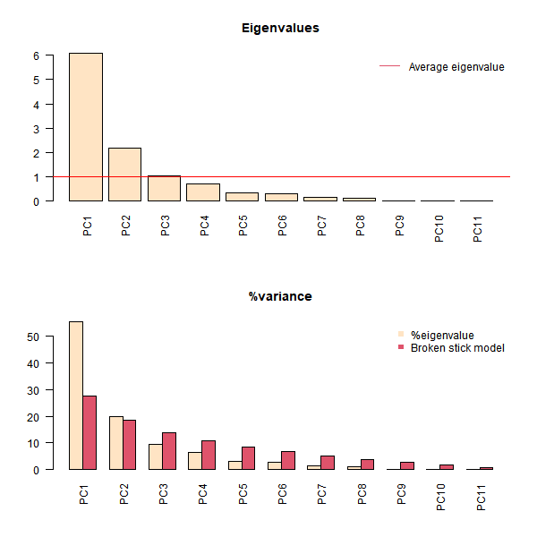
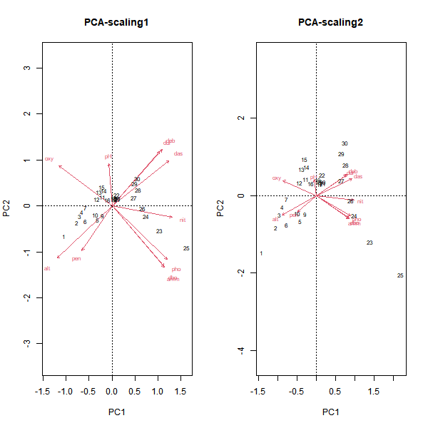
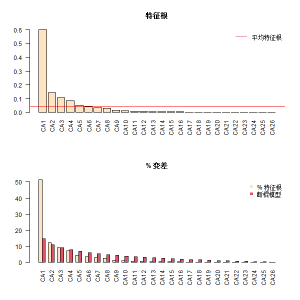
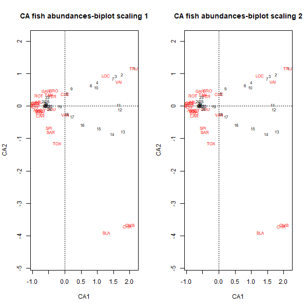
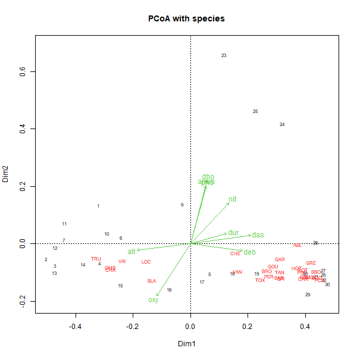
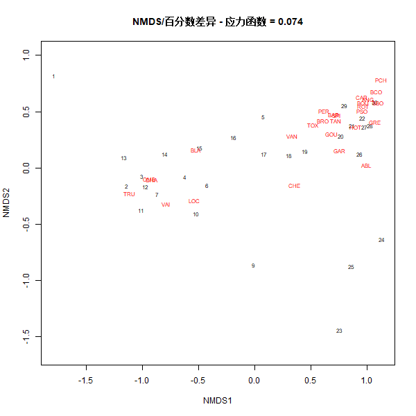
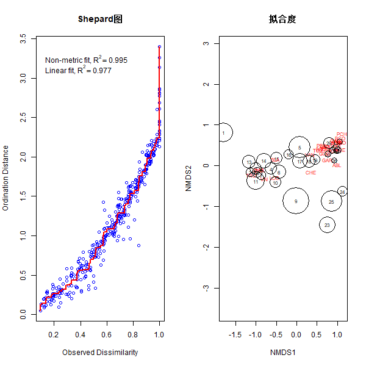

排序的目的在于寻找数据的连续性（通过连续的排序轴展示数据的主要趋势），排序分析在自然生态群落研究中特别适用，因为自然生态群落往往沿环境梯度呈连续分布。非约束性排序只是描述性方法，不存在统计检验评估约束排序方法。

[toc]

# 主成分分析（PCA）
使用`vegan`包中的`rda()`函数对数据进行PCA分析。
```R
library(vegan)
library(tidyverse)
# 导入数据
env <- read.csv("Data/DoubsEnv.csv",row.names = 1)
# 删除没有数据的样方
env <- env[-8,]
# 显示环境变量数据集的内容
summary(env)
# 全部环境变量数据的PCA分析（基于相关矩阵：参数scale=TRUE）
env_pca <- rda(env,scale = TRUE) #参数scale = TRUE表示对变量进行行标准化
summary(env_pca) #默认scaling = 2
# summary(env_pca,scaling = 1) 注意函数summary()内的参数scaling，为绘制排序图所选择的标尺类型，与函数rad()内数据标准化的参数scale无关。
```
函数`summary()`在默认`scaling = 2`的条件下输出的结果如下：
```R
Call:
rda(X = env, scale = TRUE)      

Partitioning of correlations:   
              Inertia Proportion
Total              11          1
Unconstrained      11          1

Eigenvalues, and their contribution to the correlations

Importance of components:
                         PC1    PC2     PC3     PC4     PC5     PC6     PC7     PC8      PC9     PC10      PC11
Eigenvalue            6.0980 2.1671 1.03760 0.70351 0.35185 0.31913 0.16455 0.11171 0.023109 0.017361 0.0060618
Proportion Explained  0.5544 0.1970 0.09433 0.06396 0.03199 0.02901 0.01496 0.01016 0.002101 0.001578 0.0005511
Cumulative Proportion 0.5544 0.7514 0.84570 0.90966 0.94164 0.97066 0.98561 0.99577 0.997871 0.999449 1.0000000

Scaling 2 for species and site scores
* Species are scaled proportional to eigenvalues
* Sites are unscaled: weighted dispersion equal on all dimensions
* General scaling constant of scores:  4.189264


Species scores

         PC1     PC2       PC3      PC4      PC5      PC6
das  1.08432  0.5148 -0.257430 -0.16170  0.21140 -0.09500
alt -1.04356 -0.5946  0.179904  0.12274  0.12527  0.14024
pen -0.57520 -0.5104 -0.554958 -0.80205  0.02798  0.20064
deb  0.95767  0.6412 -0.306547 -0.19434  0.18417  0.03031
pH  -0.05863  0.4820  1.034452 -0.51376  0.14431  0.05791
dur  0.90722  0.6182 -0.022833  0.15761 -0.27763  0.50792
pho  1.04604 -0.6092  0.187347 -0.11866 -0.15094  0.04919
nit  1.14317 -0.1290  0.012045 -0.18470 -0.21343 -0.34870
amm  0.99541 -0.6989  0.186019 -0.08271 -0.19250 -0.04935
oxy -1.00895  0.4578 -0.009183 -0.23449 -0.50559 -0.05661
dbo  0.98991 -0.6835  0.119635  0.03647  0.08580  0.21975


Site scores (weighted sums of species scores)

        PC1      PC2      PC3      PC4      PC5      PC6
1  -1.41239 -1.47577 -1.74581 -2.95537  0.23122  0.49150
2  -1.04170 -0.81766  0.34078  0.54374  0.92518 -1.77040
3  -0.94878 -0.48825  1.36061 -0.21762  1.05157 -0.69842
4  -0.88068 -0.29459  0.21011  0.66428 -0.23902 -0.06353
5  -0.42586 -0.66501  0.77630  0.78778  0.63144  1.17725
6  -0.77727 -0.74517 -0.06763  0.90844  0.46895 -0.32998
7  -0.78154 -0.09447  0.39332  0.23074 -0.45171  1.17422
9  -0.28731 -0.47351  0.29470  1.13214  0.69989  1.05202
10 -0.49324 -0.44889 -1.31855  0.78932 -0.38490  0.41677
11 -0.28012  0.43092  0.12222 -0.11792 -1.07089  0.46021
12 -0.44851  0.33198 -0.53100  0.60347 -0.96624  0.11902
13 -0.38853  0.68557  0.10459  0.08106 -1.10784  0.84740
14 -0.25000  0.74161  0.88640 -0.46709 -0.96780  0.74880
15 -0.31334  0.93929  1.93010 -1.27074  0.06309  0.14747
16 -0.14333  0.31109 -0.21270  0.24369 -0.61836 -0.52781
17  0.08992  0.29897 -0.18640  0.23392 -0.73322 -0.44217
18  0.05684  0.34974 -0.22088  0.14163 -0.76214 -0.60351
19  0.04508  0.40785  0.12274 -0.20084 -0.49815 -0.87652
20  0.16121  0.36121 -0.28792 -0.05336 -0.79530 -1.36030
21  0.16001  0.32539 -0.74769  0.41012  0.17144 -0.90680
22  0.14172  0.53543 -0.08102 -0.07015  0.58783 -0.24777
23  1.37609 -1.19053  0.74781 -0.35057 -0.22819  0.75871
24  0.98255 -0.51442  0.01132  0.40988  1.01286  0.84623
25  2.18629 -2.04865  0.35038 -0.29562 -1.26072 -0.38758
26  0.88331 -0.11824 -0.64837  0.33902  0.86015 -0.14587
27  0.63976  0.39427 -0.15988 -0.30084  1.09735 -0.66720
28  0.75826  0.80550  0.51025 -0.96862  0.41900 -0.74380
29  0.65317  1.09395 -1.68223  0.37783  0.43878  0.65258
30  0.73840  1.36241 -0.27154 -0.62832  1.42571  0.87947
```
PCA分析结果：
- **Inertia（惯量）**：在vegan包中，它是数据“变差”（variation）的通用术语。在PCA中，“惯量”可以是变量总方差（基于协方差矩阵PCA分析），也可以是相关矩阵的对角线数值和（基于相关矩阵的PCA），即变量自相关系数的总和，也等于变量的数量（例如本案例中有11个变量，惯量等于11）。
- **Constrained and unconstrained（约束和非约束）**：PCA是非约束排序。
- **Eigenvalue（特征根）**：用符号$\lambda$*<sub>j*表示，是每隔排序轴的重要性（方差）的指标，可以用特征根数值，也可以用占总变差的比例表示（每轴特征根除以总惯量）。
- **Scaling（标尺）**：请不要与`rda()`函数内的变量标准化参数`scale`混淆。“Scaling”是指排序结果投影到排序空间的可视化方式。一般的排序图需要同时展示对象和变量（称为“双序图”（biplot）），但没有同时可视化对象和变量的最优化方法。一般有两种标尺模式，不同模式的排序图有不同解读，即关注点不同。下面给出每种模式的最主要特征：
  - Scaling1（1型标尺）= distance biplot（距离双序图）：特征向量被标准化为单位长度，关注的是对象之间的关系。①双序图中对象之间的距离近似于多维空间内的欧氏距离。②代表变量的箭头之间的角度没有意义。
  - Scaling2（2型标尺）= correlation biplot（相关双序图）：每个特征向量被标准化为特征根的平方根，关注的是变量之间的关系。①双序图中对象之间的距离不再近似于多维空间内的欧式距离。②代表变量箭头之间的夹角反映变量之间的相关性。<br>在这两种模式下，将对象点垂直投影到变量箭头上位置表示该变量在该对象数值所有样方内的排序位置。<br>如果分析兴趣在于解读对象之间的关系，设定`scaling = 1`。如果分析兴趣在于解读变量之间的关系，设定`scaling = 2`
- **Species scores**：代表变量的箭头在排序图的坐标。由于历史的原因，在vegan包中所有的响应变量都统称为物种，不管这些变量是否真的是物种。
- **Site scores**：对象在排序图的坐标。在vegan包中，所有的对象都统称为样方。

**提取、解读和绘制vegan包输出的PCA结果**
vegan包输出的排序结果是一个复杂的实体，其元素的提取并不总是遵循R的基本规则。PCA是探索性分析方法，其目的是在低维空间内尽可能多地展示数据的主要趋势特征。

一般首先通过查看特征根，根据被解释方差的比例决定多少个排序轴值得解读和绘图。选择保留多少个排序轴没有统一标准，通常比较随意（比如75%的解释量）。也可以借助几种简单的标准帮助选择排序轴值：
- Kariser-Guttman准则：<br>先计算所有轴的特征根平均值，然后选择保留特征根超过平均值的轴；
- 断棍模型（broken stick model）：<br>主要原理是将单位长度的棍子随机分成与PCA轴数一样多的几段，然后将这些断棍按照长短依次赋予对应的轴（即最长的棍子赋予第一轴，第二长的棍子赋予第二轴，依此类推）。这时，可以有两种选择标准，第一种是选取特征根大于所对应的断棍长度的轴，第二种是选取特征根的总和大于所对应断棍长度总和前几轴。
```R
# 查看和绘制PCA输出的结果部分
?cca.object # 解释vegan包输出的排序结果对象结构和如何提取部分结果
# 特征根
(ev <- env_pca$CA$eig)
# 应用Kariser-Guttman准则选取排序轴
ev[ev > mean(ev)]
# 断棍模型
n <- length(ev)
bsm <- data.frame(j = seq(1:n),p = 0)
bsm$p[1] <- 1/n
for(i in 2:n){
    bsm$p[i] = bsm$p[i-1]+(1/(n+1-i))
}
bsm$p <- 100*bsm$p/n
bsm
# 绘制每轴的特征根和方差百分比
png("../plots/每轴的特征根和方差百分比.png",width=600,height=600)
par(mfrow = c(2,1))
barplot(ev,main = "Eigenvalues",col = "bisque",las = 2)
abline(h = mean(ev),col = "red") #特征根平均值
legend("topright","Average eigenvalue",lwd = 1,col = 2,bty = "n")
barplot(t(cbind(100*ev/sum(ev),bsm$p[n:1])),beside = TRUE,main = "%variance",col = c("bisque",2),las = 2)
legend("topright",c("%eigenvalue","Broken stick model"),pch = 15,col = c("bisque",2),bty = "n")
dev.off()
# 上面的绘图代码可以使用数量生态学中提供的脚本进行绘制
source("Script/func/evplot.R")
evplot(ev)
```

<center>图1 帮助评估具有解读价值的PCA轴的Kaiser-Guttman准则和断棍模型图。以Doubs环境数据为例。</center>

```R
# 样方和变量的双序图
# 使用biplot()函数绘图
png("../plots/样方和变量的双序图.png",width=600,height=600)
par(mfrow = c(1,2))
biplot(env_pca,scaling = 1,main = "PCA-scaling1")
biplot(env_pca,main = "PCA-scaling2") #默认scaling = 2
dev.off()
# 使用cleanplot.pca()函数绘图
source("Script/cleanplot.pca.R")
cleanplot.pca(env_pca,point = TRUE) #point = TRUE表示样方用点表示，变量用箭头表示
cleanplot.pca(env_pca) #默认样方仅用序号标识（同vegan包推荐）
cleanplot.pca(env_pca,ahead = 0) #ahead = 0表示变量用无箭头的线表示
```

<center>图2 Doubs环境数据PCA分析双序图</center>

# 对应分析（CA）
使用`vegan()`包中的`cca()`函数进行CA分析
```R
# 原始物种多度数据的对应分析(CA)
spe <- read.csv("Data/DoubsSpe.csv",row.names = 1)
spe <- spe[-8,]
spe_ca <- cca(spe)
summary(spe_ca) #默认scaling = 2
summary(spe_ca,scaling = 1)
>
Call:
cca(X = spe)

Partitioning of scaled Chi-square:
              Inertia Proportion  
Total           1.167          1  
Unconstrained   1.167          1

Eigenvalues, and their contribution to the scaled Chi-square

Importance of components:
                        CA1    CA2     CA3     CA4     CA5     CA6     CA7     CA8     CA9     CA10     CA11     CA12     CA13     CA14     CA15     CA16
Eigenvalue            0.601 0.1444 0.10729 0.08337 0.05158 0.04185 0.03389 0.02883 0.01684 0.010826 0.010142 0.007886 0.006123 0.004867 0.004606 0.003844
Proportion Explained  0.515 0.1237 0.09195 0.07145 0.04420 0.03586 0.02904 0.02470 0.01443 0.009278 0.008691 0.006758 0.005247 0.004171 0.003948 0.003294
Cumulative Proportion 0.515 0.6387 0.73069 0.80214 0.84634 0.88220 0.91124 0.93594 0.95038 0.959655 0.968346 0.975104 0.980351 0.984522 0.988470 0.991764
                          CA17     CA18     CA19     CA20      CA21      CA22      CA23      CA24      CA25      CA26
Eigenvalue            0.003067 0.001823 0.001642 0.001295 0.0008775 0.0004217 0.0002149 0.0001528 8.949e-05 2.695e-05
Proportion Explained  0.002629 0.001562 0.001407 0.001110 0.0007520 0.0003614 0.0001841 0.0001309 7.669e-05 2.310e-05
Cumulative Proportion 0.994393 0.995955 0.997362 0.998472 0.9992238 0.9995852 0.9997693 0.9999002 1.000e+00 1.000e+00

Scaling 1 for species and site scores
* Sites are scaled proportional to eigenvalues
* Species are unscaled: weighted dispersion equal on all dimensions


Species scores

         CA1      CA2      CA3      CA4      CA5      CA6
CHA  1.93586 -3.71167  0.79524 -1.06393  1.19669 -0.01694
TRU  2.14343  1.16888  1.75759  0.57516 -1.15306 -1.59651
VAI  1.65814  0.75094 -0.14555  0.06277  0.19306  0.98127
LOC  1.27267  0.94983 -1.07661 -0.03124 -0.05385  1.23887
OMB  2.00654 -3.65761  2.45774 -1.62244  2.07523  1.10190
BLA  1.28617 -3.89487 -1.46646  0.27497 -0.46548 -1.62514
HOT -0.70838 -0.13563  0.03428 -0.33249 -1.68537  0.65900
TOX -0.23836 -1.15198 -1.75354  1.46935 -2.58533  0.44908
VAN  0.01724 -0.25092 -1.76067  0.73427  0.55774 -1.90211
CHE  0.01391  0.36998 -1.06276 -1.86417  0.81585  0.81679
BAR -0.43036 -0.79135 -0.15048  0.59208 -0.69219  0.50384
SPI -0.49478 -0.67194 -0.61472  1.29546 -1.69904  1.16834
GOU -0.41473 -0.09049 -0.22662 -0.10818  0.06348 -0.76431
BRO -0.33751  0.49290  0.01884  0.63645  1.29957 -1.28472
PER -0.37296  0.31857 -0.57758  1.27315  0.96028 -0.80011
BOU -0.77780 -0.15099  0.62098  0.74218 -0.22446  1.03599
PSO -0.75678 -0.21704  0.64715  0.17377 -0.53039  0.53149
ROT -0.79737  0.32828  0.40724  0.50976  1.39905 -1.66393
CAR -0.74752 -0.29143  0.61585  1.06858  0.03018  0.74903
TAN -0.48862  0.36325 -0.23888  0.33176  1.12847 -0.14296
BCO -0.90598  0.02936  1.22855  0.73277  0.60846  0.64673
PCH -0.94471 -0.02395  1.69979  1.11466  1.24087  0.84214
GRE -0.89392  0.10256  1.15059 -0.63712 -0.22872 -0.05439
GAR -0.56990  0.46561 -0.72328 -1.19519  0.57099 -0.21413
BBO -0.91492  0.08505  1.24936  0.10467  0.21598  0.56002
ABL -0.81412  0.14105  0.46416 -2.29054 -1.82642 -1.01000
ANG -0.82011 -0.11026  0.91871  0.77593  0.13405  0.99313


Site scores (weighted averages of species scores)

        CA1       CA2        CA3       CA4       CA5      CA6
1   2.14343  1.168878  1.7575907  0.575155 -1.153061 -1.59651
2   1.76398  0.974804  0.4146591  0.252762 -0.429551 -0.02841
3   1.56461  0.927572  0.1684981  0.229368 -0.235605  0.11459
4   0.99607  0.735478 -0.0821999  0.220804  0.124347  0.02164
5   0.06880  0.385730 -0.4767740  0.137649  0.611487 -0.59835
6   0.79995  0.650556 -0.3126227  0.004573  0.208785  0.08153
7   1.48401  0.857273 -0.0000461  0.115048 -0.243045  0.06572
9   0.19839  0.548288 -0.8443683 -0.985772  0.537369  0.55588
10  0.96530  0.579970 -0.6431806 -0.119049  0.158175  0.31065
11  1.66289  0.041901  0.5276521 -0.236838  0.122453  0.20692
12  1.68551 -0.095617  0.5190277 -0.235278  0.119512  0.21582
13  1.79036 -0.773009  0.6283025 -0.174635  0.146337 -0.03037
14  1.45079 -0.859665  0.3625011 -0.233420  0.248779  0.02258
15  1.04393 -0.686198 -0.2109962 -0.152467  0.174580 -0.13740
16  0.54432 -0.570386 -0.6464636  0.284420 -0.212539 -0.26014
17  0.22308 -0.317953 -0.4015561  0.211655 -0.356642  0.11725
18  0.04108 -0.246196 -0.3024740  0.103285 -0.216664  0.15902
19 -0.15958 -0.002755 -0.3326130  0.020330 -0.234943  0.10523
20 -0.44870  0.016281 -0.1199041 -0.043366 -0.139347  0.02069
21 -0.52189  0.014771  0.0391417  0.049826 -0.033352 -0.02458
22 -0.55765  0.005583  0.0721997  0.039264  0.021482 -0.00423
23 -0.54606  0.279423 -0.2144273 -1.910111 -0.566501 -0.35434
24 -0.65102  0.148231  0.1836056 -1.267193 -0.583479 -0.19782
25 -0.53085  0.159144 -0.0937082 -0.809453 -0.085257 -0.80556
26 -0.58769  0.079869  0.1930653 -0.202133 -0.004271 -0.02205
27 -0.58178  0.038326  0.1811782 -0.037380  0.066234  0.02307
28 -0.60374  0.033808  0.2417050  0.015027  0.092978  0.08844
29 -0.47146 -0.077222  0.1809010  0.125954  0.034090  0.05241
30 -0.62686 -0.007444  0.2190226  0.254487  0.119787  0.03366

# 绘制每轴的特征根和方差百分比
(ev2 <- spe_ca$CA$eig)
source("Script/func/evplot.R")
png("../plots/CA分析每轴的特征根和方差百分比.png",width=600,height=600)
evplot(ev2)
dev.off()
```

<center>图3 帮助评估具有解读价值的CA轴的Kaiser-Guttman准则和断棍模型图。以原始Doubs鱼类数据为例</center>

```R
# 绘制CA双序图
png("../plots/CA分析样方变量的双序图.png",width=600,height=600)
par(mfrow = c(1,2))
# 1型标尺：样方点是物种点的形心
plot(spe_ca,scaling = 1,main =  "CA fish abundances-biplot scaling 1")
# 2型标尺（默认）：物种点是样方点的形心
plot(spe_ca,scaling = 1,main = "CA fish abundances-biplot scaling 2")
dev.off()
```

<center>图4 Doubs鱼类多度数据CA双序图</center>

# 主坐标分析（PCoA）
**利用`cmdscale()`和`vegan包`对Doubs数据进行PCoA分析**
```R
# 基于鱼类物种数据Bray-Curtis相异矩阵的PCoA分析
spe <- read.csv("Data/DoubsSpe.csv",row.names = 1)
env <- read.csv("Data/DoubsEnv.csv",row.names = 1)
spe <- spe[-8,]
env <- env[-8,]
png("../plots/PCoA-物种加权平均投影.png",width=600,height=600)
spe_bray <- vegdist(spe)
spe_b_pcoa <- cmdscale(spe_bray,k = (nrow(spe)-1),eig = TRUE) #绘制样方主坐标排序图并用加权平均方法将物种投影到样方的PCoA排序图内
ordiplot(scores(spe_b_pcoa)[,c(1,2)],type = "t",main = "PCoA with species")
abline(h = 0,lty = 3)
abline(v = 0,lty = 3)
# 添加物种
spe_wa <- wascores(spe_b_pcoa$points[,1:2],spe)
text(spe_wa,rownames(spe_wa),cex = 0.7,col = "red")
# 拟合环境变量
(spe_b_pcoa_env <- envfit(spe_b_pcoa,env))
>
***VECTORS

        Dim1     Dim2     r2 Pr(>r)    
das  0.99031  0.13891 0.7208  0.001 ***
alt -0.99360 -0.11297 0.5659  0.001 ***
pen -0.79277  0.60953 0.1078  0.136    
deb  0.99152 -0.12997 0.5324  0.002 **
pH  -0.24915 -0.96847 0.0480  0.518
dur  0.96140  0.27515 0.2769  0.029 *
pho  0.26728  0.96362 0.6912  0.001 ***
nit  0.68217  0.73119 0.6117  0.001 ***
amm  0.24946  0.96839 0.7076  0.001 ***
oxy -0.54779 -0.83661 0.7639  0.001 ***
dbo  0.25236  0.96763 0.8561  0.001 ***
---
Signif. codes:  0 '***' 0.001 '**' 0.01 '*' 0.05 '.' 0.1 ' ' 1
Permutation: free
Number of permutations: 999
# 投影显著的环境变量
plot(spe_b_pcoa_env,p.max = 0.05,col = 3)
dev.off()
```

> 不要担心R发出的关于物种得分的警告，因为物种得分不可能在PCoA的第一步获得。<br>`ordiplot(scores(spe_b_pcoa)[,c(1,2)],type = "t",main = "PCoA with species")`
`species scores not available`


<center>图5 PCoA-物种加权平均投影</center>

# 非度量多维尺度分析（NMDS）
如果排序的目的不是在于最大限度保留对象之间实际的差异，只是反映对象之间的顺序关系，这个时候非度量多维尺度分析（nonmetric multidimensional scaling,NMDS）可能是一种解决方案。

```R
spe <- read.csv("Data/DoubsSpe.csv",row.names = 1)
spe <- spe[-8,]
spe_nmds <- metaMDS(spe,distance = "bray")
>
Run 0 stress 0.07477809 
Run 1 stress 0.1104318  
Run 2 stress 0.1127482  
Run 3 stress 0.08845295 
Run 4 stress 0.07477823
... Procrustes: rmse 0.0004114949  max resid 0.001975717 
... Similar to previous best
Run 5 stress 0.08843942
Run 6 stress 0.07478416
... Procrustes: rmse 0.00363385  max resid 0.01443399
Run 7 stress 0.1111011
Run 8 stress 0.07376237 
... New best solution
... Procrustes: rmse 0.0194111  max resid 0.09464712
Run 9 stress 0.1133733
Run 10 stress 0.1110548
Run 11 stress 0.1216001
Run 12 stress 0.1165874
Run 13 stress 0.07477816
Run 14 stress 0.1234441 
Run 15 stress 0.1150026
Run 16 stress 0.0884167
Run 17 stress 0.07478407
Run 18 stress 0.126193
Run 19 stress 0.1252111
Run 20 stress 0.07477808 
*** No convergence -- monoMDS stopping criteria:
    20: stress ratio > sratmax

spe_nmds
>
Call:
metaMDS(comm = spe, distance = "bray")       

global Multidimensional Scaling using monoMDS

Data:     spe
Distance: bray

Dimensions: 2
Stress:     0.07376237
Stress type 1, weak ties
No convergent solutions - best solution after 20 tries
Scaling: centring, PC rotation, halfchange scaling
Species: expanded scores based on 'spe'

spe_nmds$stress
>
[1] 0.07376237

png("../plots/NMDS双序图.png",width=600,height=600)
plot(
  spe_nmds,
  type = "t",
  main = paste(
    "NMDS/百分数差异 - 应力函数 =",
    round(spe_nmds$stress,3)
  )
)
dev.off()
```

<center>图6 基于鱼类多度百分数差异相异矩阵数据的NMDS双序图</center>

```R
# 评估NMDS拟合度的Shepard图
png("R-packages/数量生态学/plots/评估NMDS拟合度的Shepard图.png",width=600,height=600)
par(mfrow = c(1,2))
stressplot(spe_nmds,main = "Shepard图")
gof <- goodness(spe_nmds)
plot(spe_nmds,type = "t",main = "拟合度")
points(spe_nmds,display = "sites",cex = gof*300)
dev.off()
```

<center>图7 检验NMDS结果的Shepard图和拟合度图</center>

